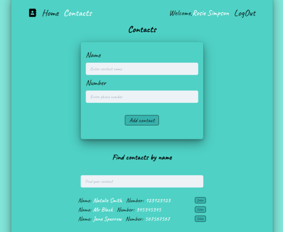

# React Contact Book

## Main Technologies

React, Redux, WebPack, Chakra UI, Formik, Yup, REST API, NodeJS, Express, MongoDB, Mongoose.

## Description

[Live Demo Contact Book Application - Youtube](https://youtu.be/SRUNXeeRg7Y)

Contact book is an application for keeping, adding or deleting contacts for different users.





## Deploy

[Link](https://olgamykhailova.github.io/react-phonebook/)

## Project setup

```
npm install
npm start
```
